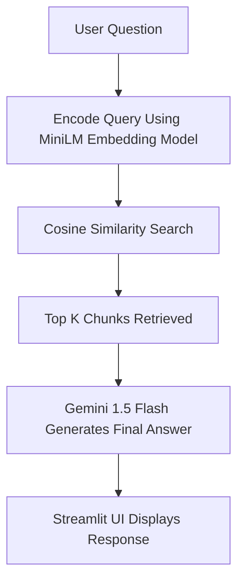

---

#  Company Policy AI Assistant

A lightweight Retrieval-Augmented AI Agent built for the **48-Hour AI Agent Development Challenge**.
This agent answers HR, onboarding, and company FAQ questions using internal documents.

---

##  Overview

The AI Assistant is designed to help employees instantly retrieve answers from company policies, onboarding guides, and FAQs.

This system is built using:

* **SentenceTransformer MiniLM embeddings** for document understanding
* **Cosine similarity-based retrieval**
* **Gemini 1.5 Flash** for final answer generation
* **Streamlit** for a clean, modern UI
* **Local TXT files** as the knowledge base (no heavy vector databases)

It is extremely lightweight and optimized for laptops with limited storage.

---

##  Features

###  Core Capabilities

* Ask HR & policy-related questions
* Retrieves the most relevant context from your documents
* AI generates a clean final answer
* Modern, premium UI
* Very fast and extremely lightweight

###  Technical Features

* MiniLM sentence embeddings
* Custom RAG pipeline
* No external database required
* Streamlit-based frontend
* Gemini Flash LLM reasoning engine

---

##  Limitations

* Only works with text-based knowledge sources
* Cannot answer questions outside the provided documents
* Retrieval quality depends on chunking

---

##  Tech Stack

| Layer      | Technology                 |
| ---------- | -------------------------- |
| LLM        | Gemini 1.5 Flash           |
| Embeddings | SentenceTransformer MiniLM |
| Retrieval  | Cosine Similarity          |
| UI         | Streamlit                  |
| Data       | TXT files in `/docs`       |
| Language   | Python                     |

---

##  Project Structure

```
/project/
│
├── app.py
├── requirements.txt
├── README.md
│
└── /docs/
    ├── company_policy.txt
    ├── onboarding.txt
    └── faq.txt
```

---

## 🛠️ Setup Instructions

### 1️⃣ Install Dependencies

```bash
pip install -r requirements.txt
```

### 2️⃣ Add Your Gemini API Key

**Windows (PowerShell):**

```bash
setx GEMINI_API_KEY "your_key_here"
```

**Mac/Linux:**

```bash
export GEMINI_API_KEY="your_key_here"
```

Or add a `.env` file.

---

## ▶️ Running the Application

```bash
streamlit run app.py
```

---

#  Architecture (RAG Pipeline)

This system uses a lightweight RAG pipeline to answer queries:

```
User Question
      ↓
SentenceTransformer Embedding
      ↓
Cosine Similarity Search
      ↓
Top Chunk Retrieved
      ↓
Gemini 1.5 Flash (LLM)
      ↓
Final Answer Displayed in Streamlit
```

---

##  Architecture Diagram

A PNG diagram is included:

**`architecture_diagram.png`**

Or generated using this Mermaid code:



---

#  Future Improvements

* Add document upload from UI
* Add multi-file embedding caching
* Add chat history memory
* Enable PDF, DOCX parsing
* Add authentication / admin panel
* Add response streaming

---


